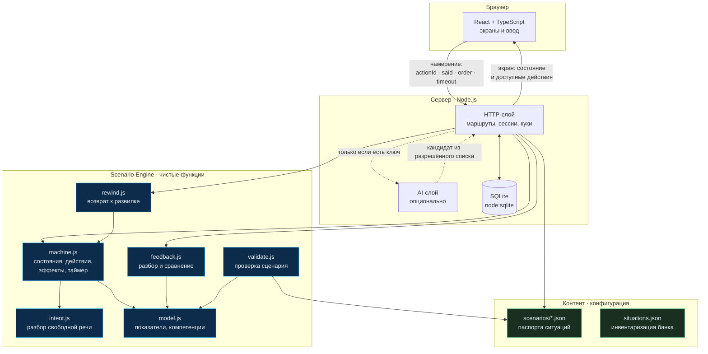
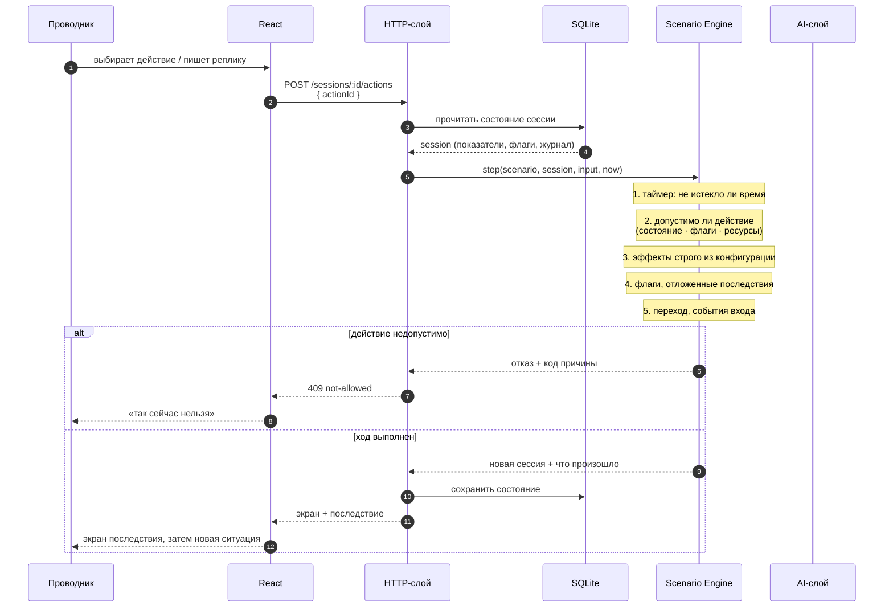
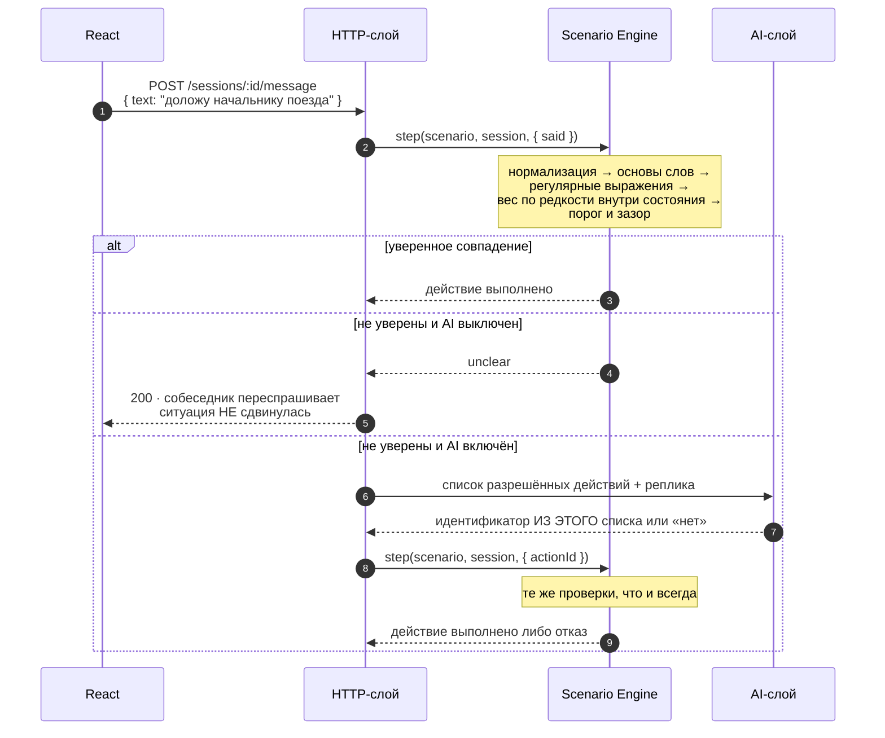
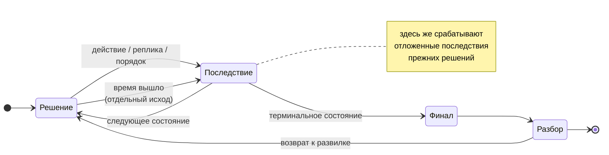
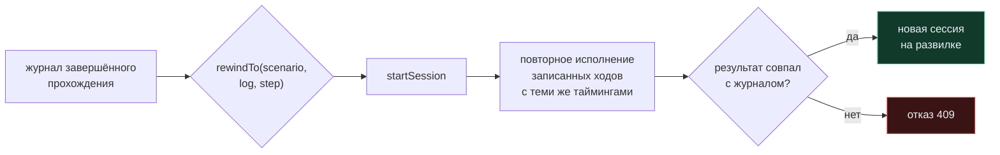
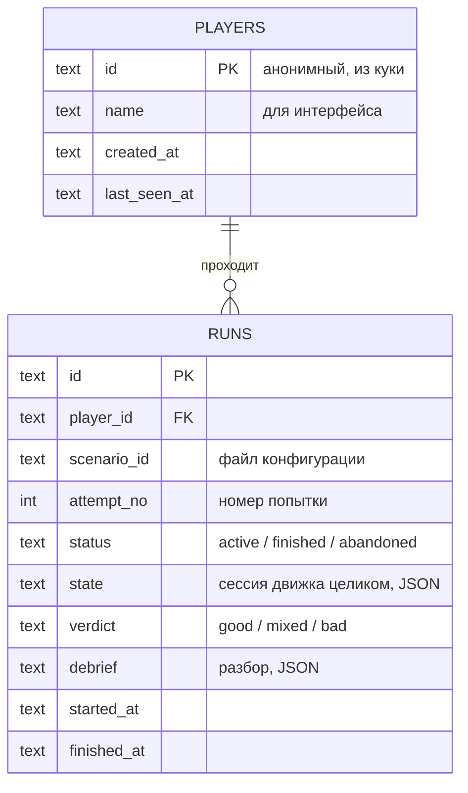
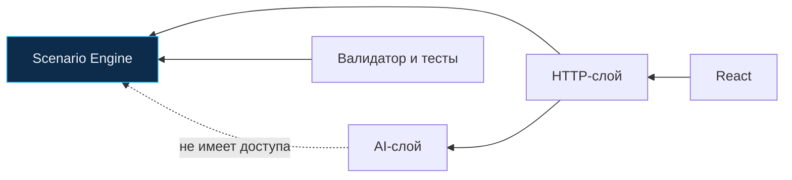

# Архитектура «Смены 400»

Документ описывает, из чего состоит продукт, кто за что отвечает и как
проходит один ход. Главный вопрос, на который отвечает архитектура:
**где живёт игровая истина и почему именно там**.

---

## 1. Один принцип, из которого следует остальное

> Клиент присылает **намерение**, а не результат. Состояние читается из базы,
> ход выполняет движок, результат возвращается клиенту.

Из этого принципа выводятся все остальные решения:

- граф сценария **не уходит на клиент** — иначе все ветки, эффекты и финалы
  видны в исходниках страницы, а отложенное последствие, которое можно
  прочитать заранее, перестаёт быть последствием;
- таймер решает **сервер** по своим часам — иначе его обходят задержкой;
- свободная реплика разбирается **на сервере** — выбор действия это часть
  игровой логики, а не интерфейса;
- AI **не может** изменить состояние — он возвращает только идентификатор
  из уже разрешённого списка, и тот проходит обычную проверку.

---

## 2. Компоненты

### Кто за что отвечает

| Слой | Отвечает за | Не знает про |
|---|---|---|
| **React** | отображение и ввод | эффекты, переходы, будущие состояния |
| **HTTP** | кто спрашивает, чтение и запись состояния | как считаются эффекты |
| **Scenario Engine** | всю игровую истину | HTTP, базу, React |
| **Контент** | ситуации, действия, эффекты, тексты | код |
| **AI** | форму реплики, запасной разбор | состояние, переходы, нормативную логику |

Ядро — обычные функции над данными, без единого обращения к сети или базе.
Поэтому одна и та же логика исполняется на сервере, в тестах и в валидаторе
контента и нигде не расходится.

---

## 3. Один ход: последовательность

### Свободная реплика — тот же путь, но с разбором

**Модель не может обойти движок.** Единственное, что она возвращает, —
идентификатор из списка, который ей дали; любой другой ответ отбрасывается.
Без ключа ветка просто не работает, и человек получает переспрос.

---

## 4. Состояние сценария

Сценарий — граф состояний, а не последовательность экранов.

Переход выбирается не только действием, но и флагами: `next_when` позволяет
одному и тому же решению вести в разные состояния в зависимости от того,
что игрок делал раньше, — **без единой строчки кода в движке**.

---

## 5. Возврат к развилке

Повторное прохождение в этом продукте точечное: человек возвращается
не в начало, а к конкретному решению.

Реализовано **повторным исполнением**, а не снимками состояния. Движок
детерминирован по построению, поэтому те же входы дают то же состояние.
Побочный эффект, ради которого выбран именно такой способ: возврат
к развилке служит непрерывной проверкой детерминированности. Разойдись
движок хоть в одном месте — воспроизведение откажет явно, вместо того чтобы
показать человеку развилку, на которой он не был.

---

## 6. Данные

Таблиц три, и все они видны глазами.

**Сценарии в базе не лежат.** Они — конфигурация: файлы в `content/scenarios`,
читаемые при старте сервера. Новая ситуация добавляется файлом, и ничего
не нужно пересобирать или мигрировать.

В `runs.state` хранится состояние сессии целиком, как его посчитал движок.
Клиент его не присылает и не может подправить.

---

## 7. Стек и почему такой

| Слой | Решение | Почему |
|---|---|---|
| Клиент | React 18 + TypeScript + Vite + Tailwind | приложение полностью клиентское, SSR нечего давать |
| Сервер | Node.js, стандартный `http` | десяток маршрутов; фреймворк добавил бы зависимость и ничего не упростил |
| База | встроенный `node:sqlite` | без нативной сборки и без шага генерации схемы |
| ORM | нет | три таблицы и десяток запросов |
| AI | `fetch` к OpenAI-совместимому API | без SDK; слой опционален по построению |

Зависимостей в проде — две: `react` и `react-dom`. Всё остальное
инструменты сборки. Следствие: `npm install` предсказуем, а стенд
поднимается на любой машине с Node 22.5+.

---

## 8. Почему ядро отделено от всего остального

Ядро можно запустить без сервера, без базы и без браузера. Это не эстетика,
а три практических следствия:

1. **Валидатор контента** использует тот же код, что и игра, поэтому
   «корректный сценарий» имеет ровно одно определение, а не три.
2. **Тесты** проверяют игровую логику напрямую: 48 тестов проходят
   за 200 миллисекунд, без поднятия сервера.
3. **Возврат к развилке** возможен именно потому, что ядро детерминировано
   и не зависит от внешнего состояния.

Схема зависимостей односторонняя — ядро не знает ни про кого:

