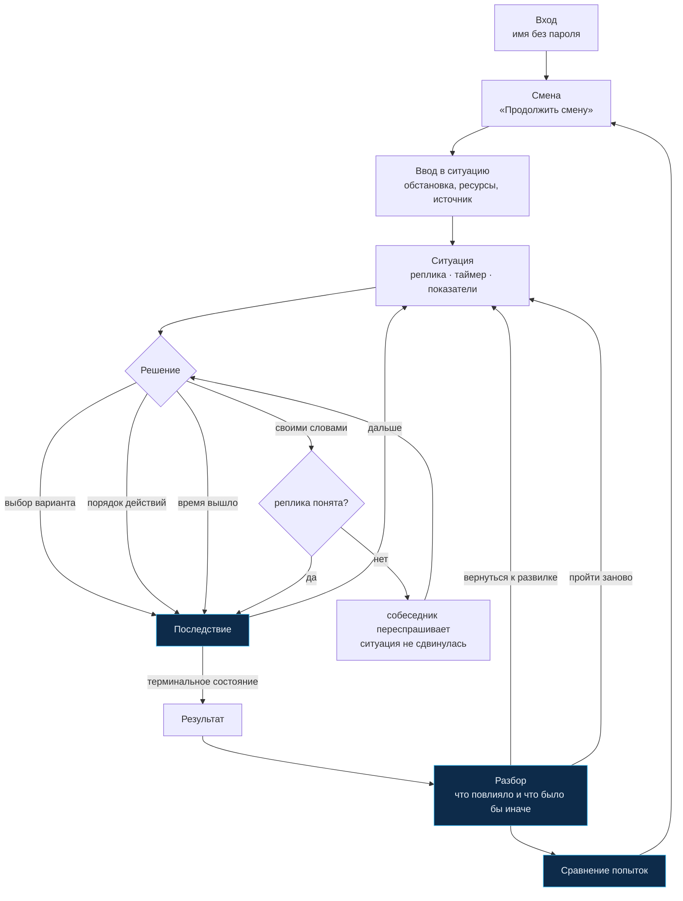
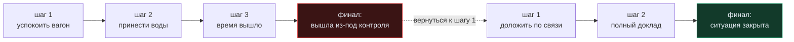

# Пользовательский сценарий и примеры прохождений

Документ описывает, что делает человек в продукте, и показывает два разных
прохождения одной ситуации — чтобы было видно, что решения действительно
меняют развитие событий, а не только цифры.

---

## 1. Основной поток



### Экраны

| Экран | Отвечает на вопрос |
|---|---|
| **Вход** | кто я в этой системе |
| **Смена** | что делать дальше |
| **Ввод в ситуацию** | где я и чем располагаю |
| **Ситуация** | что происходит и что я могу сделать |
| **Последствие** | что изменилось от моего решения и почему |
| **Результат** | чем всё кончилось |
| **Разбор** | что на это повлияло и как было бы иначе |
| **Сравнение** | что изменилось между попытками |
| **Профиль** | что я проходил и что в этом проявилось |

Экран последствия — отдельный шаг сознательно. Если показывать результат
решения строкой над новой репликой, человек успевает прочитать только
реплику, и причинно-следственная связь теряется.

---

## 2. Пример: два прохождения одной ситуации

Ситуация **№19 «Пассажиру стало плохо»** (банк «Ситуации на борту»).
Нормативная опора — 974-р: *«Просьбы пассажиров, имеющие неотложный характер
(например, оказание первой помощи), должны выполняться в приоритетном
порядке»*.

Показатели на старте: лояльность **60**, безопасность **85**.

### Прохождение А — доклад первым действием

| Шаг | Что на экране | Решение | Что изменилось |
|---:|---|---|---|
| 1 | «Девушка, скорее! Мужчине рядом плохо…» · таймер 25 с | **Нажать кнопку связи и доложить начальнику поезда** | безопасность **+8**<br/>*«Доклад ушёл в первые секунды. Начальник поезда уже связывается с диспетчером»*<br/>**Основание:** 974-р о приоритетном порядке |
| 2 | Начальник поезда: «Что у вас? Мне нужно сказать диспетчеру конкретно» | **«вагон четыре, место 14В, мужчина без сознания, дыхание есть»** *(своими словами)* | безопасность **+9**, лояльность **+2**<br/>*«Диспетчер принял заявку с первого раза»* |
| 3 | Порядок действий до станции | объявление → освободить проход → зафиксировать | безопасность **+7**, лояльность **+6** |
| 4 | Фельдшер из вагона 6: «Скажите, что уже сделано» | **передать коротко и по делу** | безопасность **+6**, лояльность **+7** |
| 5 | «Что передать бригаде на платформе?» | **передать всё** | безопасность **+5**, лояльность **+3** |

**Финал: ситуация закрыта.** Лояльность 78, безопасность 100.
*«Решающими были первые двадцать секунд. Доклад ушёл до того, как вы узнали
подробности, — и именно поэтому у диспетчера хватило времени».*

### Прохождение Б — сначала успокоить вагон

| Шаг | Решение | Что изменилось |
|---:|---|---|
| 1 | **Попросить пассажирку не кричать и не пугать вагон** | лояльность **−9**, безопасность **−5**<br/>*«Вагон притих. К пассажиру по-прежнему никто не подошёл»* |
| 2 | **Принести воды** | лояльность **+2**, безопасность **−4** |
| 3 | *время вышло* | лояльность **−6**, безопасность **−10**<br/>*«Ситуацией дальше занимались без вас»* |

**Финал: ситуация вышла из-под контроля.** Лояльность 56, безопасность 70.
*«Ни одно из ваших действий не было грубой ошибкой по отдельности. Проблема
в том, на что ушли первые минуты».*

### Что показывает сравнение

```
Чем кончилось    Ситуация закрыта  →  Ситуация вышла из-под контроля
Лояльность       78 → 56   −22
Безопасность    100 → 70   −30

Что вы сделали по-другому
  шаг 1   было:  Нажать кнопку связи и доложить начальнику поезда
          стало: Принести воды
```

Одно решение на первом шаге — и другой финал. Это и есть главное
утверждение продукта, и оно доказывается данными прохождения, а не текстом.

---

## 3. Отложенное последствие

Механика, ради которой в движке есть очередь: решение аукается не сразу.

**Ситуация №16 «Не работает розетка».** Пассажир жалуется на розетку.
Можно сразу пересадить его — быстро, вежливо, человек доволен:

```
Шаг 1  «Сразу предложить пересесть»        лояльность +9 · безопасность −2
       «Пассажир пересел, подключился и успокоился»
```

Через два шага приходит то, чего игрок не связывал с этим решением:

```
Последствие прежнего решения               безопасность −9
«Неисправность в блоке ряда 6 так и осталась незамеченной: кроме розетки
 там не работает кнопка вызова, и об этом до сих пор никто не знает»
```

А ещё через шаг выясняется, что́ именно это значит:

```
Сопровождающий пассажирки в кресле-коляске:
«Мы нажимаем кнопку вызова уже минут пять — она не работает.
 Нам нужно к санитарной зоне, а без помощи мы не доберёмся»
```

Связь с причиной интерфейс **не подписывает** — её человек находит
в разборе. Найденная связь запоминается лучше подписанной.

Нормативная опора здесь двойная: 990-р — *«столы рекомендуется оборудовать
кнопкой вызова персонала»*; 989-р — *«коммуникация с маломобильными
пассажирами должна быть обеспечена на всех этапах обслуживания»*.

---

## 4. Свободная речь

На части состояний можно отвечать своими словами. Знать идентификаторы,
ключевые слова или формат команд не нужно — человек пишет так, как сказал бы
вслух.

| Реплика | Результат |
|---|---|
| «доложу начальнику поезда и попрошу медиков на станцию» | распознано → доклад |
| «подойду и проверю пульс и дыхание» | распознано → осмотр |
| «вызову по рации: нужна помощь в шестом вагоне» | распознано → нейтральный вызов |
| «скажу по рации что у меня пьяный пассажир» | распознано → вызов с названием состояния *(и это ошибка, которую источник запрещает)* |
| «ну как-то так» | **не распознано** → собеседник переспрашивает, ситуация не сдвинулась |

Разбор детерминированный: нормализация → основы слов → регулярные выражения →
вес слова по редкости **внутри состояния** → порог уверенности и зазор
до второго варианта. При сомнении продукт не угадывает.

---

## 5. Возврат к развилке

После разбора под каждым ключевым решением есть кнопка
**«Вернуться сюда и решить иначе»**.



Всё, что было до развилки, сохраняется — включая набранные показатели
и флаги. Человек проверяет одну гипотезу, а не переигрывает то, в чём был прав.

---

## 6. Пять ситуаций MVP

Все из банка «Ситуации на борту» (51 ситуация). Ни одна не придумана.

| № | Ситуация | Механика | Чему учит |
|---:|---|---|---|
| **6** | Пассажир с признаками опьянения | выбор · реплика · эскалация · бездействие | единственное правило банка о том, **чего не говорить** по рации |
| **16** | Не работает розетка / мультимедиа / кнопка вызова | выбор · реплика · отложенное последствие | жалоба про комфорт оказывается отказом связи с бригадой |
| **19** | Пассажиру стало плохо | выбор · реплика · **порядок действий** · таймер | источник называет три действия, но не их порядок |
| **20** | Пассажир курит на борту | реплика · эскалация · таймер | два требования источника тянут в разные стороны |
| **41** | Бесхозная вещь | выбор · реплика · **показатели «порядок» и «безопасность»** | правильное действие противоречит первому побуждению |

Остальные 46 инвентаризованы в `content/situations.json` — новая добавляется
файлом сценария, без изменений в движке.
